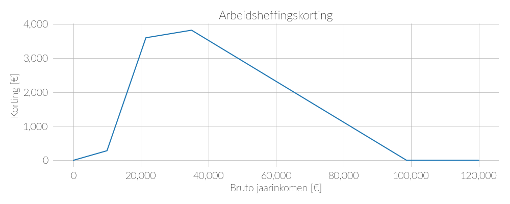
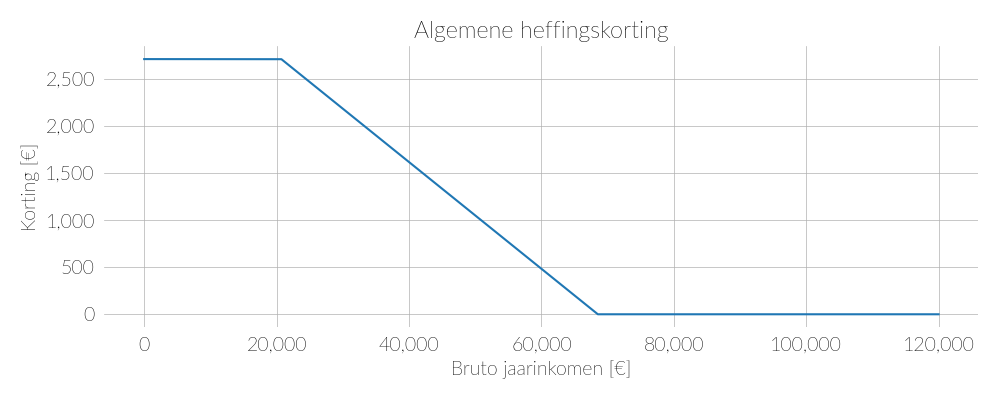

Hieronder staan alle heffingskortingen. Daarvan zal ik alleen de dikgedrukte items behandelen.

- **Algemene heffingskorting**
- **Arbeidskorting**
- Inkomensafhankelijke combinatiekorting
- Heffingskortingen voor AOW-gerechtigden
- Jonggehandicaptenkorting
- Levensloopverlofkorting
- **Heffingskorting voor groene beleggingen**

Bron: [Belastingdienst](https://www.belastingdienst.nl/wps/wcm/connect/bldcontentnl/belastingdienst/prive/inkomstenbelasting/heffingskortingen_boxen_tarieven/heffingskortingen/totaaloverzicht/overzicht-heffingskortingen-2021)

## Arbeidskorting

## Algemene heffingskorting

## Heffingskorting voor groene beleggingen

## Heffingskortingen applet

<iframe width="100%" height='800pt' scrolling='no' src='https://8050-94692084-a304-48d4-bb78-4d61cca12334.europe-west1.cloudshell.dev/?authuser=0' style="border:0px"></iframe>

